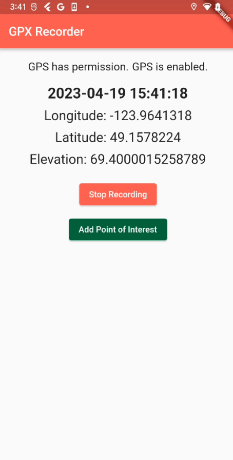
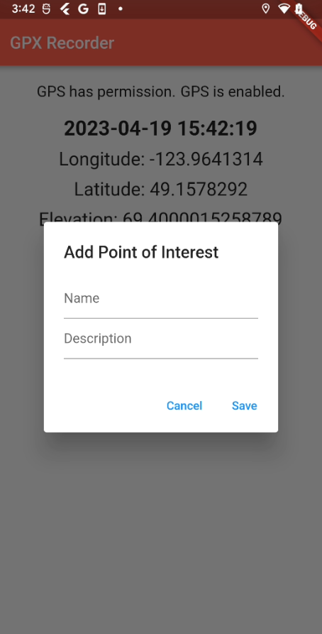

# GPX Recorder

  
  
  

## Application Overview

This GPS recording app allows users to track their bike rides and create GPX files containing the route and ride information. The app uses the device's GPS to record location data, including latitude, longitude, elevation, and time, and saves it to a GPX file. Users can also view their ride history and share their rides with friends.

## Known Issues

A database is not currently enabled to upload and share routes. A MySQL Database will be integrated in future.

## Bug Report

No bugs or issues have been reported with this app.
This application has also yet to be tested on iOS platform.

## How to Use the App

1. Download and install the app on your mobile device.
2. Launch the app and allow it to access your device's GPS.
3. Tap the "Start Recording" button to begin recording your ride.
4. Once you're finished with your ride, tap the "Stop Recording" button to stop recording.
5. You can view your ride history by tapping the "View Saved GPX" button.

## Tutorials and Open-Source Projects

This app was created using the following tutorials and open-source projects:

- https://pub.dev/packages/geolocator
- https://pub.dev/packages/flutter_background_geolocation

## ChatGPT Contribution

ChatGPT was used in the development of this app to create the xml needed to output a GPX file. ChatGPT was also used for layout suggestions and occassional debugging.

## Conclusion

This GPS recording app is a simple and effective way to track bike rides and save ride data for later viewing or sharing with friends. The app is easy to use and can be customized to fit different needs, such as adding additional data fields or integrating with other apps or services.